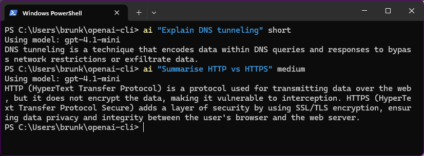
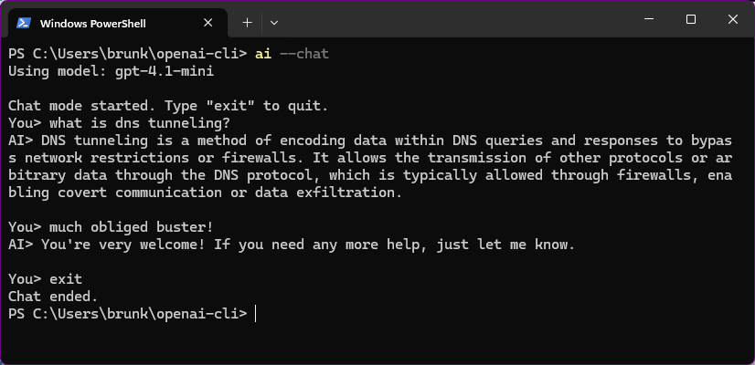
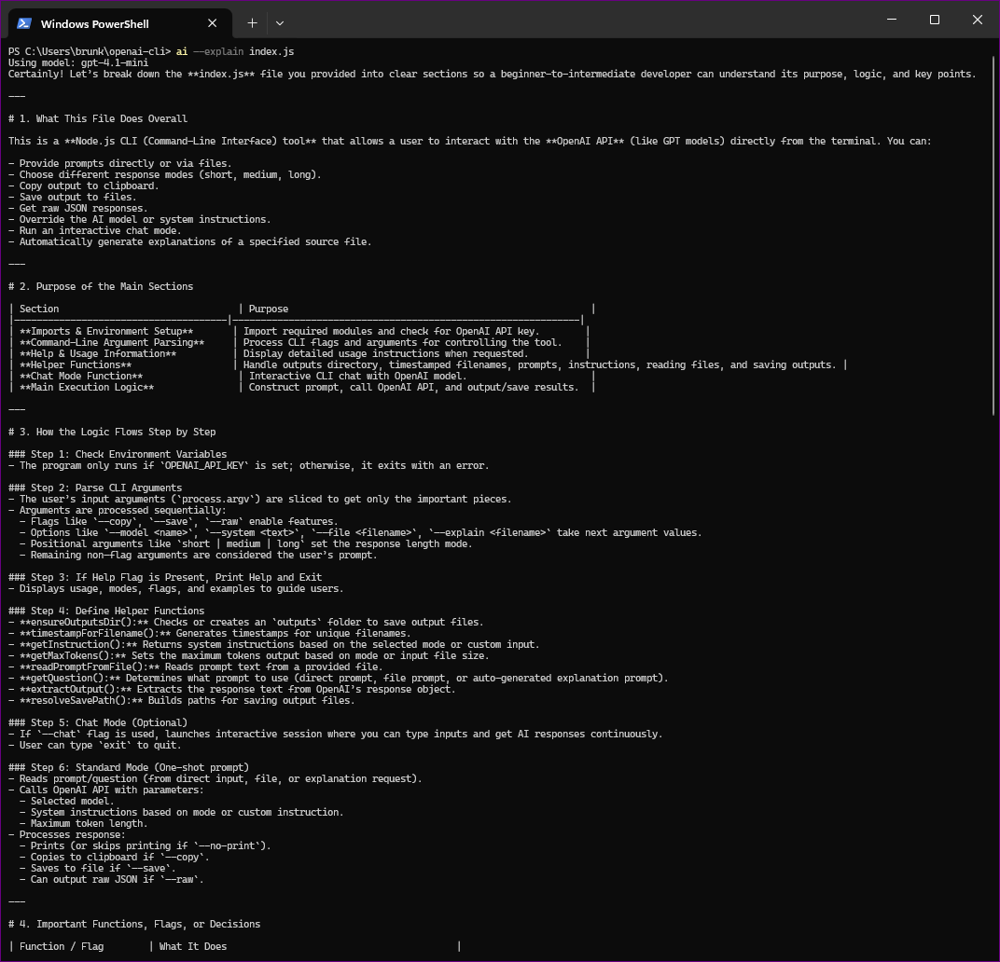
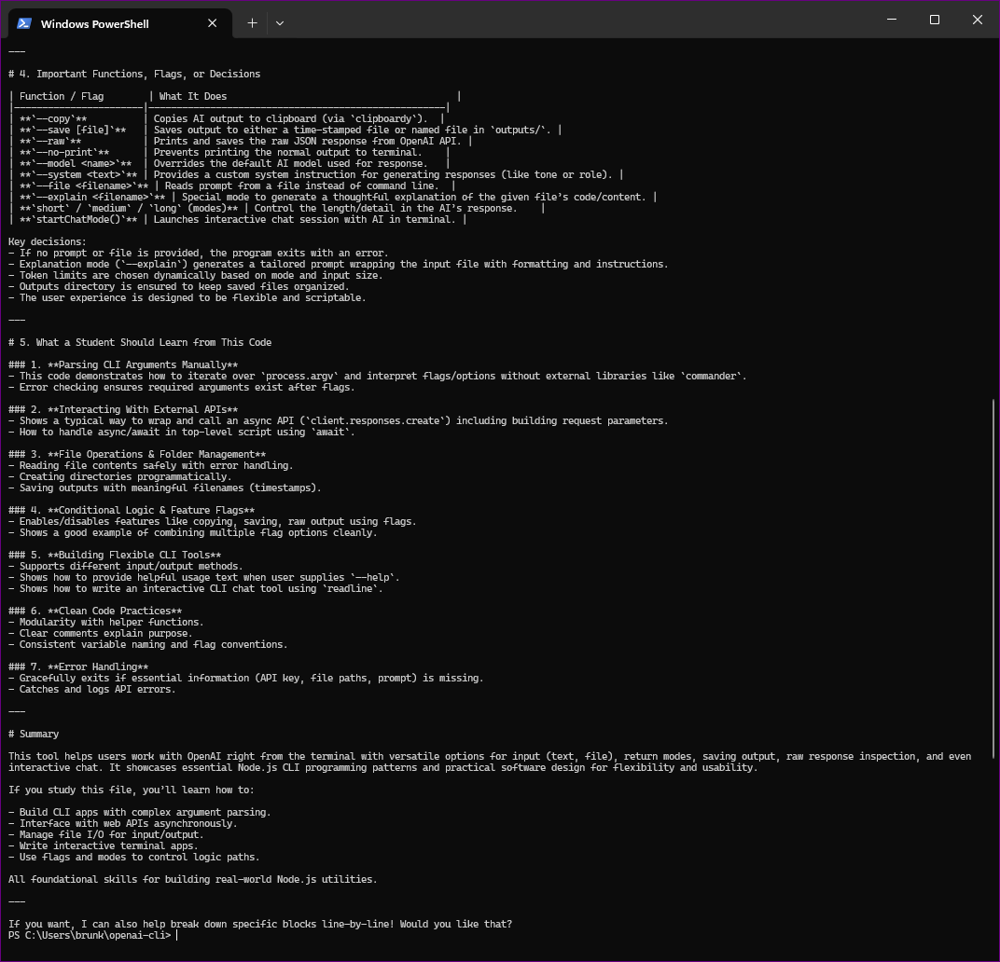
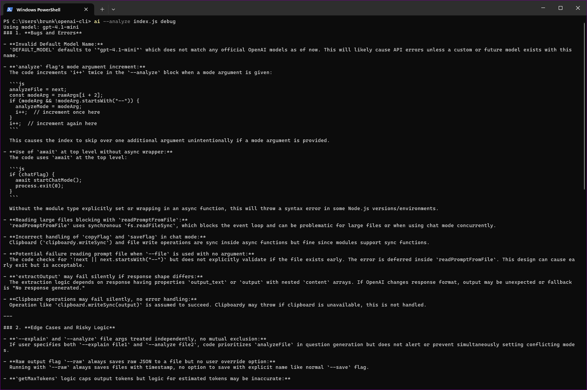
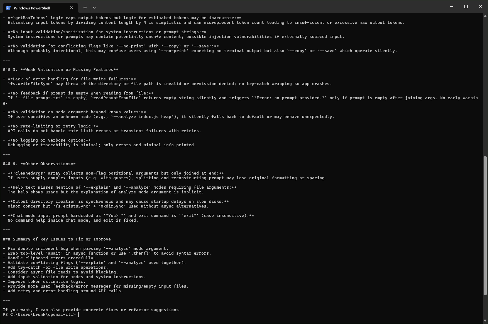

# OpenAI CLI Assistant

A fast, developer-focused CLI tool for interacting with OpenAI directly from your terminal.

Designed for real-world workflows: quick queries, file-based prompts, code explanation, and developer-level analysis — all without leaving the command line.

---

## Demo

Run directly from terminal:

```
ai "Explain DNS tunneling" short
```

Output:

```
DNS tunneling is a technique that encodes data inside DNS queries to bypass network restrictions.
```

No UI, no browser — everything runs directly in your terminal.

---

## Features

* Prompt-based interaction from terminal
* Response modes: `short`, `medium`, `long`
* Interactive chat mode (`--chat`)
* File input support (`--file`)
* Code explanation mode (`--explain`)
* Code analysis mode (`--analyze`)
* Clipboard integration (`--copy`)
* Save output to file (`--save`)
* Raw API response output (`--raw`)
* Model override (`--model`)
* Custom system instructions (`--system`)

---

## Explain Code Files

Explain any code or text file instantly:

```
ai --explain index.js
```

The CLI generates structured explanations including:

* Overall purpose
* Code structure
* Logic flow
* Key functions
* Learning insights for developers

Examples:

```
ai --explain index.js --copy
ai --explain index.js --save explanation.txt
ai --explain index.js long
```

---

## Analyze Code (Developer Mode)

Analyze code for deeper understanding, debugging, and optimization:

```
ai --analyze index.js
ai --analyze index.js debug
ai --analyze index.js optimize
```

Modes:

* `explain` → structure and design understanding
* `debug` → bugs, edge cases, risky logic
* `optimize` → performance and readability improvements

---

## Example Output

### Basic Prompt



### Chat Mode



### Code Explanation

#### Part 1



#### Part 2



### Code Analysis

#### Debug Analysis



#### Optimization Suggestions



---

## Installation

Clone the repository:

```
git clone https://github.com/brunkonjaa/openai-cli.git
cd openai-cli
npm install
```

Create a `.env` file:

```
OPENAI_API_KEY=your_api_key_here
OPENAI_MODEL=gpt-4.1
```

Or copy example:

```
cp .env.example .env
```

Link the CLI globally:

```
npm link
```

Now you can use:

```
ai "your prompt here"
```

---

## Usage

### Basic

```
ai "What is DNS tunneling?"
```

### Modes

```
ai "Explain subnetting" short
ai "Explain subnetting" long
```

### File Input

```
ai --file prompt.txt
```

### Explain Code

```
ai --explain index.js
```

### Analyze Code

```
ai --analyze index.js debug
```

### Chat Mode

```
ai --chat
```

---

## Output Handling

* `--copy` → copies result to clipboard
* `--save` → saves output to file
* Outputs are stored in the `outputs/` directory by default

---

## Why This Project Matters

This project demonstrates:

* Building a real CLI tool using Node.js
* Integration with OpenAI API
* Secure environment-based configuration
* Manual argument parsing (no heavy frameworks)
* Feature design for real developer workflows
* Code explanation and analysis tooling
* Clean Git workflow and version control

This reflects modern developer workflows:

* Fast iteration
* Terminal-based automation
* Understanding unfamiliar code quickly

---

## Future Improvements

* Multi-file analysis support
* Diff-based analysis
* Streaming responses
* Colored CLI output
* Plugin-style extensions

---

## GitHub Topics

* cli
* nodejs
* openai
* productivity
* developer-tools
* automation

---

## Author

Bruno Suric
