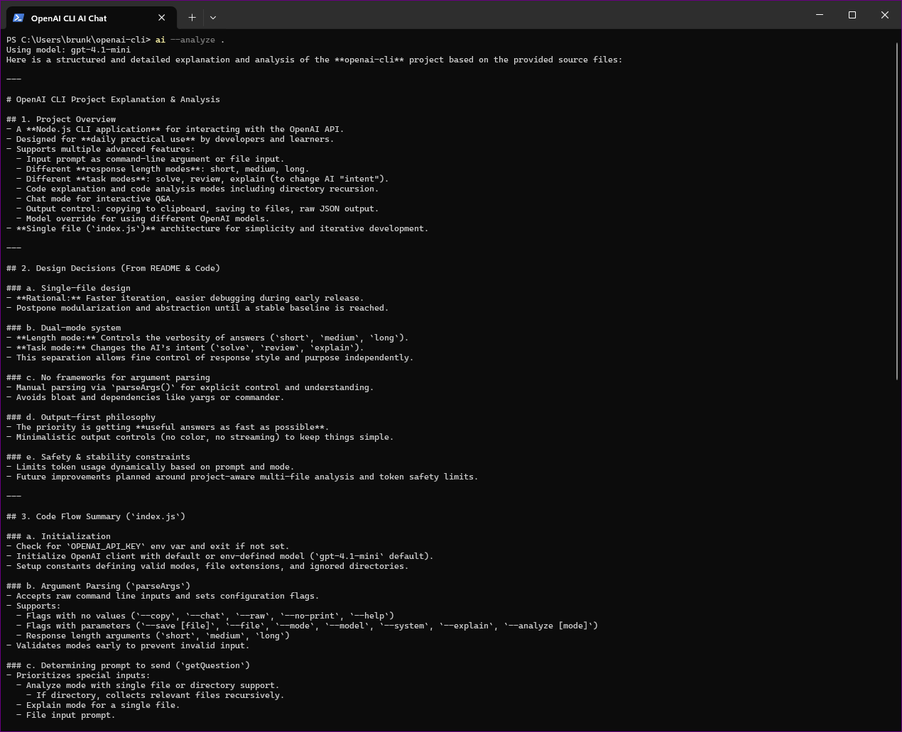
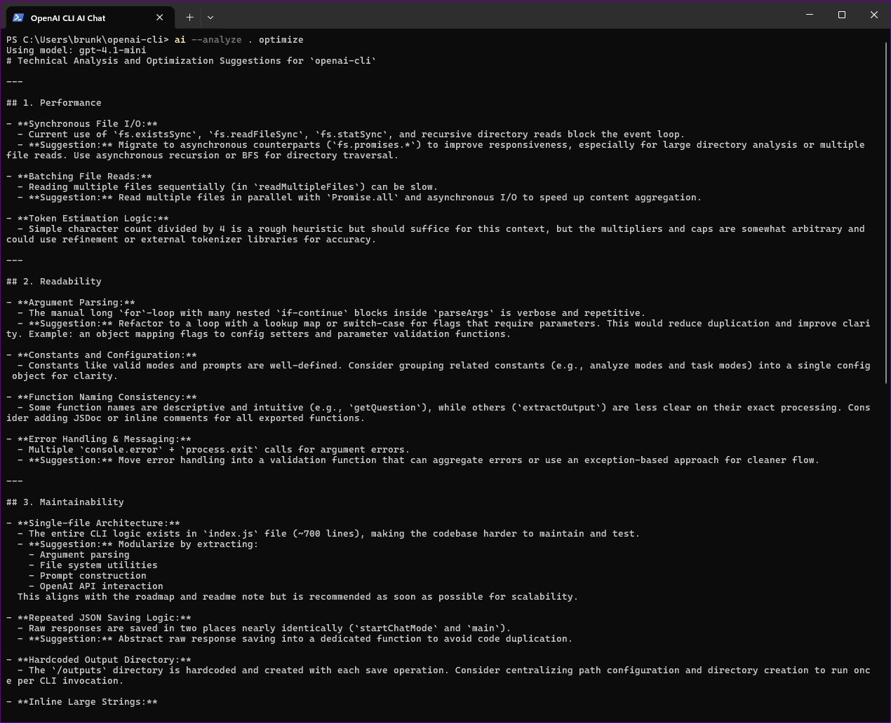
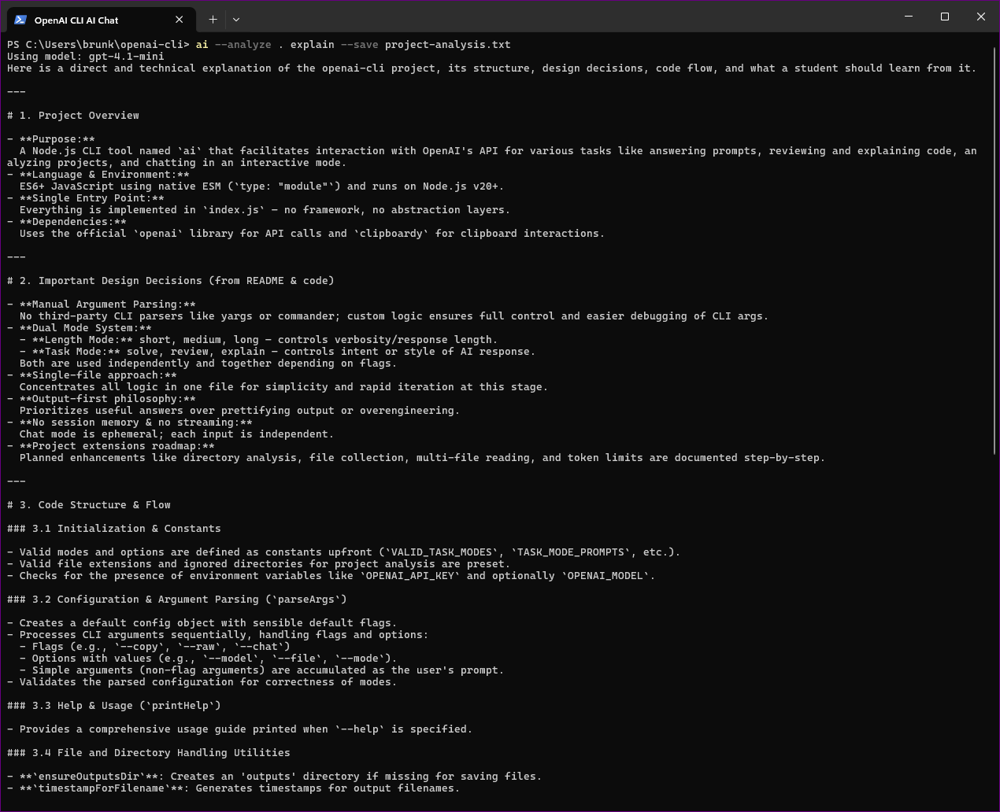

# OpenAI CLI Assistant

A developer-focused CLI tool for interacting with OpenAI directly from the terminal.

Built for real workflows: quick queries, file-based prompts, code explanation, and project analysis without leaving the command line.

---

## Quick Preview

```bash
ai --analyze .
```

### Project Analysis



### Debug Mode


### Optimize Mode



### Save Output



---

## What This Is

This started as a simple CLI wrapper and grew into something more useful.

It is now a project-aware AI assistant for developers working in the terminal.

It helps you:

* understand code quickly
* debug issues
* improve structure and readability
* run prompts without context switching to a browser

---

## Core Features

### Prompt Execution

```bash
ai "Explain DNS tunneling"
ai "Explain subnetting" short
```

---

### Response Length

```text
short     → one short sentence
medium    → 2–3 clear sentences (default)
long      → structured explanation
```

---

### Task Modes

```bash
--mode solve
--mode review
--mode explain
```

| Mode    | Purpose                        |
| ------- | ------------------------------ |
| solve   | direct, practical answers      |
| review  | critical analysis and feedback |
| explain | structured learning output     |

---

### File Input

```bash
ai --file prompt.txt
```

---

### Code Explanation

```bash
ai --explain index.js
```

Provides a structured breakdown of what the file does and how it works.

---

### Code Analysis

```bash
ai --analyze index.js
ai --analyze index.js debug
ai --analyze index.js optimize
ai --analyze .
```

Supports both single-file and project-level analysis.

---

### Chat Mode

```bash
ai --chat
```

Interactive terminal session.

---

### Output Handling

```bash
--copy        copy to clipboard
--save        save to file (auto name)
--save file   save to named file
--raw         print raw JSON
--no-print    silent mode
```

Saved outputs go to:

```
/outputs
```

---

### Model Control

```bash
--model gpt-4.1
```

Default:

```
.env → OPENAI_MODEL
fallback → gpt-4.1-mini
```

---

## Installation

```bash
git clone https://github.com/brunkonjaa/openai-cli.git
cd openai-cli
npm install
npm link
```

---

## Platform Notes

### Windows (PowerShell)

```powershell
git clone https://github.com/brunkonjaa/openai-cli.git
cd openai-cli
npm install
npm link
```

If `ai` is not recognized:

* restart terminal
* ensure npm global path is in PATH

---

### Linux

```bash
git clone https://github.com/brunkonjaa/openai-cli.git
cd openai-cli
npm install
npm link
```

If permission issues occur:

```bash
sudo npm link
```

---

### macOS

```bash
git clone https://github.com/brunkonjaa/openai-cli.git
cd openai-cli
npm install
npm link
```

If needed:

```bash
sudo npm link
```

---

## Requirements

* Node.js 20 or newer
* npm
* OpenAI API key

Check your version:

```bash
node -v
```

---

## Setup

Create a `.env` file in the root:

```bash
OPENAI_API_KEY=your_api_key_here
OPENAI_MODEL=gpt-4.1-mini
```

Or copy the example:

```bash
cp .env.example .env
```

Then replace the placeholder with your real API key.

---

## Security Warning

Do not commit your `.env` file.

Your API key provides access to your account and usage.

Make sure:

* `.env` is in `.gitignore`
* you do not paste keys into code
* you do not include keys in screenshots or commits

If exposed, revoke the key immediately.

---

## Global Usage

After linking:

```bash
npm link
```

Run from anywhere:

```bash
ai "your prompt"
```

---

## Architecture

Core logic lives in a single file:

```
index.js
```

Supporting folders handle assets and outputs.

Handles:

* argument parsing
* prompt building
* file and directory analysis
* API communication
* output handling

No external CLI frameworks are used.

Argument parsing is implemented manually to keep full control over behavior and reduce abstraction.

---

## Why This Project Matters

This project demonstrates:

* building a practical CLI tool in Node.js
* manual argument parsing without helper libraries
* structured AI usage (task modes and response control)
* code understanding and analysis workflows
* real developer tooling patterns

It reflects how developers actually work:

* from the terminal
* with real code
* focusing on speed and clarity

---

## Current State

Version:

v1.2 — Project-aware CLI

Completed:

* directory analysis
* recursive file discovery
* multi-file parsing
* structured analysis modes

---

## Roadmap

Next:

* improve technical depth of analysis output
* prioritise relevant files during project scans
* refine prompt structure for more consistent results

Later:

* streaming responses
* colored CLI output
* modular structure (if needed)

---

## Design Philosophy

* minimal structure
* full control over behavior
* features must solve real problems
* clarity over complexity

---

## Topics

cli
nodejs
openai
developer-tools
automation
ai

---

## Author

Bruno Suric
